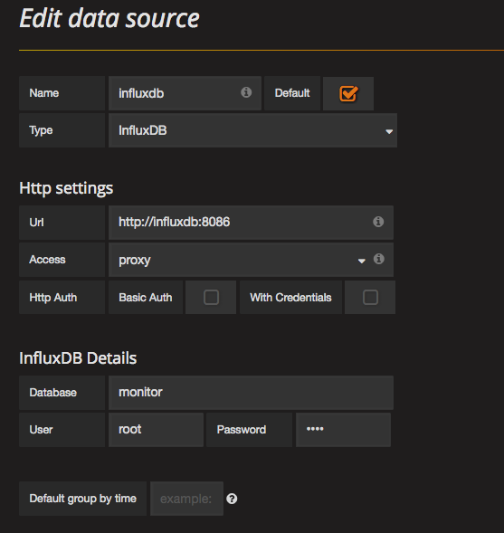
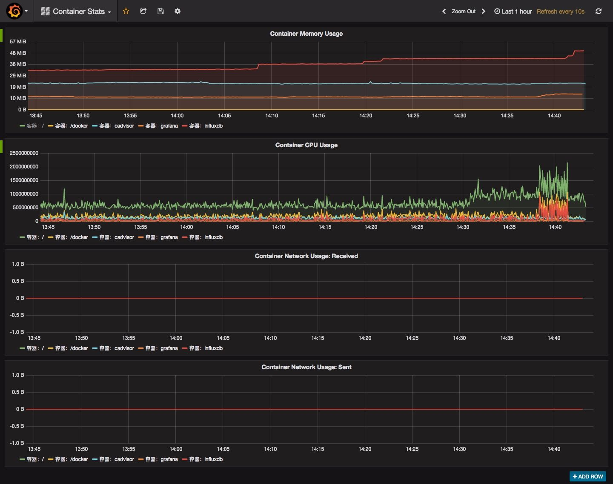

# docker 监控方案实战

influxdb:1.8.10

## 部署时序数据库influxdb

生成配置influxdb配置文件(可选)

```shell
docker run --rm influxdb:1.8.10 influxd config > influxdb.conf
```

启动influxdb

```shell
docker run -d --name influxdb -p 8083:8083 -p 8086:8086 \
      -v $PWD/influxdb:/var/lib/influxdb \
      -e TZ=Asia/Shanghai \
      influxdb:1.8.10 -config \
      /etc/influxdb/influxdb.conf
```

tips：

+ 如果需要自定义配置则加上"-v $PWD/influxdb.conf:/etc/influxdb/influxdb.conf:ro"
+ 上述命令行中的-e TZ=Asia/Shanghai是设定时区，仅在base image为debain/ubuntu/centos时有效，alpine不支持

## 创建用户和数据库

启动docker实例后，开启一个新终端，创建用户和数据库

```shell
# 启动客户端
influxdb
# 创建用户
CREATE USER monitor WITH PASSWORD 'monitor@2022' WITH ALL PRIVILEGES
# 创建数据库
create database "monitor";
```

以上步骤完成后，再修改influxdb.conf，将http分区下的"auth-enabled"的值改为true，开启认证，然后重启实例。

测试http接口：

```sql
curl "http://192.168.50.88:8086/query?u=monitor&p=monitor%402022&q=show%20databases"
```

## 部署cAdvisor

```shell
docker run -d --name=cadvisor \
		-v /:/rootfs:ro \
        -v /var/run:/var/run:rw \
		-v /sys:/sys:ro \
		-v /var/lib/docker:/var/lib/docker:ro \
		-p 8080:8080  \
		--link influxdb:influxdb \
		google/cadvisor:v0.23.2 \
		-logtostderr -v 2 \
		-storage_driver=influxdb \
		-storage_driver_db=monitor \
		-storage_driver_host=influxdb:8086
```

ps: 上述命令中的storage_driver_db的值为上一步创建的数据库的名字

## 部署grafana

```shell
docker run -d --name grafana \
		-p 3000:3000 -e INFLUXDB_HOST=localhost \
		-e GF_SECURITY_ADMIN_PASSWORD=secret  \
		--link influxdb:influxdb \
		grafana/grafana:3.0.4
```

ps: 上述命令中的storage_driver_db的值为第一步创建的数据库的名字

打开浏览器，访问http://localhost:3000，以admin/secret登录，配置influxdb数据源：

 	

再使用Dashboards—>Import功能将面板配置container_stats.json导入。

demo 界面： 



OneAPM Cloud Insight部署：

```shell
docker run -d --name oneapm-ci-agent \
  -h `hostname` \
  -v /var/run/docker.sock:/var/run/docker.sock \
  -v /proc/:/host/proc/:ro \
  -v /sys/fs/cgroup/:/host/sys/fs/cgroup:ro \
  -e LICENSE_KEY=YOUR_CLOUD_INSIGHT_LICENSE_KEY \
  oneapm/docker-oneapm-ci-agent:latest
```

grafana dashboard导入：https://grafana.com/grafana/dashboards/